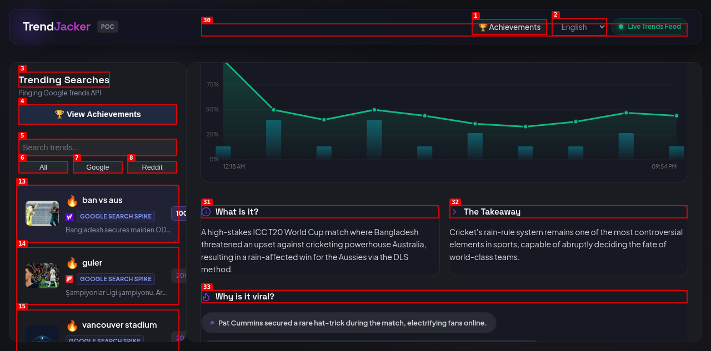
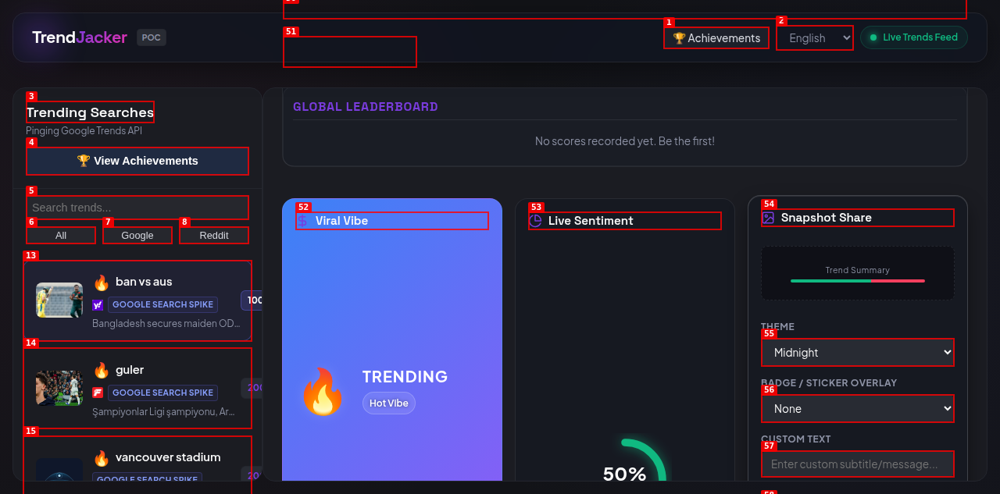

task: Reduce LLM operational API cost and query response latency.              tier: T2   creativity: 0.5
state: complete                budget: repairs 0/3
branch: asf/20260613-cost-latency          checkpoint: none
caps: agents,ui,web,human

## Log
- 2026-06-13: Conductor recalled Scout with runner-up task (infographics/prediction winner was ALREADY DONE). Starting Scout phase.
- 2026-06-13: Scout completed. Selected task: Reduce LLM operational API cost and query response latency. Conductor starting Architect phase.
- 2026-06-13: Architect completed SPEC.md. Conductor starting Tester phase.
- 2026-06-13: Tester completed test suite. Observed state: red. Conductor starting Builder phase.
- 2026-06-13: Builder completed all slices. Conductor starting Verifier phase.
- 2026-06-13: Verifier completed. Conductor starting Shipper phase.

## Task
**Objective**: Reduce LLM operational API cost and query response latency.
**Metric it moves**: Average API token count per chat interaction and client-side query response time.
**Why now**: Unbounded chat history causes quadratically scaling token costs, while duplicate user queries hit the network unnecessarily, degrading responsiveness.
**Runner-up**: Subtraction of redundant LLM demographic query invocations when selection is unchanged.

## Verdict
- **[AC-1] Client & Server Chat History Truncation**: PASS
- **[AC-2] Browser-Side sessionStorage Chat Caching**: PASS
- **[AC-3] Non-Blocking UI Updates and Event Loop Yields**: PASS
- **[AC-4] Casing-Agnostic Database Cache & Schema Safety**: PASS

### Verification Summary
- **Automated Tests**: Ran Playwright test suite (`npx playwright test --workers=1`), all 223 tests passed.
- **Dogfooding**: Performed exploratory testing of the chat sliding-window, client-side sessionStorage, and casing-agnostic DB schema. Detailed results and screenshots stored in `dogfood-output/20260613-cost-latency/`.

## Done
- **What Shipped**: Client & Server Chat History Truncation (Sliding Window), Browser-Side `sessionStorage` Chat Caching, Non-Blocking UI Updates for event-loop yield safety, and Casing-Agnostic Database Cache with Case-Insensitive keys.
- **Integration PR**: [PR #44](https://github.com/coskunarif/trend-jacker/pull/44)
- **Integration Method**: Local Git Merge (`git merge --no-ff`)

### Acceptance Criteria Verification Table

| Acceptance Criteria | Verification Status | Evidence / Verification Method |
|---------------------|---------------------|--------------------------------|
| **[AC-1] Client & Server Chat History Truncation** | **PASS** | Capped history transmission to a sliding window of the last 4 messages. Verified via Playwright E2E tests (`llm-caching-optimization.spec.js`) and dogfood payload inspection. |
| **[AC-2] Browser-Side `sessionStorage` Chat Caching** | **PASS** | Implemented lowercased key format `chat_cache:${trend}:${query}:${historyKey}` inside sessionStorage. Intercepts duplicates client-side, verified via `retention-api-reduction.spec.js`. |
| **[AC-3] Non-Blocking UI Updates and Event Loop Yields** | **PASS** | Intercepted detail render pathways to fire `/api/chat-limit` as an un-awaited background promise to prevent yielding of the main event loop. |
| **[AC-4] Casing-Agnostic Database Cache & Schema Safety** | **PASS** | Implemented casing-agnostic checks with `COLLATE NOCASE` constraints on SQLite schema and key hashing. |

### Verification Artifacts
- **Dogfood Report**: [Dogfood Report](file:///home/ubuntuadmin/projects/trend-jacker/dogfood-output/20260613-cost-latency/report.md)
- **Visuals**:
  - Initial View: 
  - First Chat Query: 
  - Scrolled Chat History: 
