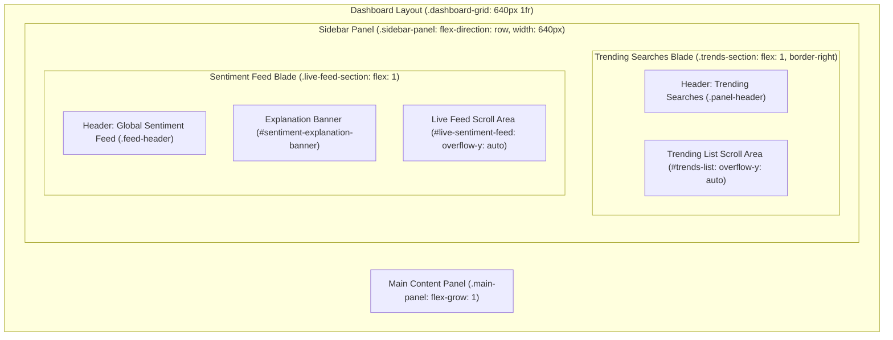

# SPEC: Desktop Side-by-Side Double-Blade Sidebar Redesign

To improve user experience and retention, we will redesign the sidebar layout on desktop viewports. The current vertical stacking of the **Trending Searches** and the **Global Sentiment Live Feed** creates visual clutter and a double scrollbar issue. We will transition this to a side-by-side "Twin Blades" layout on desktop screens, while fully preserving the drawer behavior and tab switching capability on mobile devices.

---

## Visual Layout Mockup (Desktop Viewport)

---

## Acceptance Criteria

- **[AC-1] Desktop Double-Blade Sidebar Grid**:
  - In viewports >= 769px (desktop), the main dashboard layout container (`.dashboard-grid`) must display two columns: a `640px` sidebar column and a flexible `1fr` main panel column (`grid-template-columns: 640px 1fr`).
  - The left sidebar (`.sidebar-panel`) must layout its child components horizontally side-by-side using `flex-direction: row`.
  - The first blade (Trending Searches, wrapped in `.trends-section`) and the second blade (Global Sentiment Feed, `.live-feed-section`) must divide the sidebar space equally (each `320px` wide).
  - A vertical border of `1px solid var(--border)` must separate the two blades.
  - Validation: E2E Playwright tests on desktop viewports (e.g., width 1280px) must verify that `.trends-section` and `.live-feed-section` are visible simultaneously, have the same vertical top position (`y` coordinate within a 5px margin of error), and have distinct `x` coordinates (side-by-side), with their combined bounding box widths totaling `640px`.

- **[AC-2] Scrollbar & Overflow Isolation**:
  - Prevent redundant scrollbars on the parent columns. The `.trends-section` and `.live-feed-section` containers must have `overflow: hidden`.
  - Only the inner list containers (`#trends-list` and `#live-sentiment-feed` / `.feed-scroll-container`) should be scrollable (`overflow-y: auto;`).
  - Column headers (`.panel-header` and `.feed-header`) must remain static and fixed at the top of their respective columns on desktop.
  - Validation: Verify in E2E tests that parent container elements do not have active vertical overflow, while inner scroll containers allow vertical scroll events.

- **[AC-3] Mobile Drawer & Tab Switcher Behavior Preservation**:
  - In viewports <= 768px (mobile), the sidebar drawer must remain `290px` wide.
  - The mobile tab switcher (`.sidebar-tabs`) must toggle visibility between the Trending Searches list and the Global Sentiment Feed list:
    - **"Trending" Tab Active**: The Trending Searches header text and `#trends-list` must be visible. The Global Sentiment Feed (`.live-feed-section`) must be hidden (`display: none !important`).
    - **"Sentiment Feed" Tab Active**: The tab bar and `.live-feed-section` must be visible. The `#trends-list` and `.panel-header-text` must be hidden. The `.trends-section` wrapper must shrink to fit only the tab header height (`flex: 0 0 auto; height: auto;`), allowing `.live-feed-section` to expand and occupy the full remaining vertical space.
  - Validation: E2E tests on a mobile viewport (e.g., width 375px) must toggle between both tabs and verify visibility transitions using robust retrying assertions (e.g., Playwright's `expect().toPass()`).

- **[AC-4] View Transitions Integrity**:
  - View Transitions API integration during mobile tab switches must not be disabled or bypassed based on `navigator.webdriver`.
  - Validation: Verify that the view transition tests continue to pass and transitions execute in automated testing environments.

---

## Out of Scope

- Simplifying the sidebar layout to show Trending Searches only (this is the runner-up and is not selected).
- Any modifications to the main panel (`.main-panel`) layout, logic, or styles.
- Modifying backend APIs, SSE feed logic, or caching schemas.

---

## Slices

Task type: **refinement** (layout update). Test strategy: **update/snapshot tests** (Tester will update existing E2E sidebar tests before Builder implements the slices).

- **[S-1] HTML DOM Wrapping**:
  - **Description**: In `public/index.html`, wrap the Trending Searches elements (the first `.panel-header` and `#trends-list`) in a new container div with the class `trends-section`. Keep `.live-feed-section` as a sibling to `.trends-section` inside `.sidebar-panel`.
  - **ACs mapped**: `[AC-1]`, `[AC-3]`
  - **Files**: `public/index.html`
  - *This slice is independent.*

- **[S-2] CSS Layout & Responsiveness Implementation**:
  - **Description**: Add CSS rules in `public/styles.css` for the side-by-side layout on desktop (using a media query `@media (min-width: 769px)`). Apply `grid-template-columns: 640px 1fr` to `.dashboard-grid` and `flex-direction: row` to `.sidebar-panel`. Add `border-left: 1px solid var(--border)` and remove `border-top` on `.live-feed-section` on desktop. Set `overflow: hidden` on the outer containers and keep `overflow-y: auto` on inner containers. On mobile (under `@media (max-width: 768px)`), ensure `.trends-section` shrinks to auto height when `.show-sentiment` is active.
  - **ACs mapped**: `[AC-1]`, `[AC-2]`, `[AC-3]`, `[AC-4]`
  - **Files**: `public/styles.css`
  - *Depends on [S-1].*
